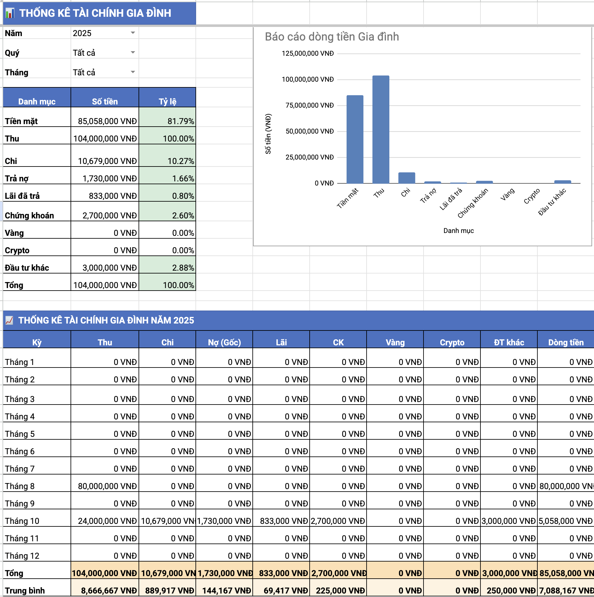
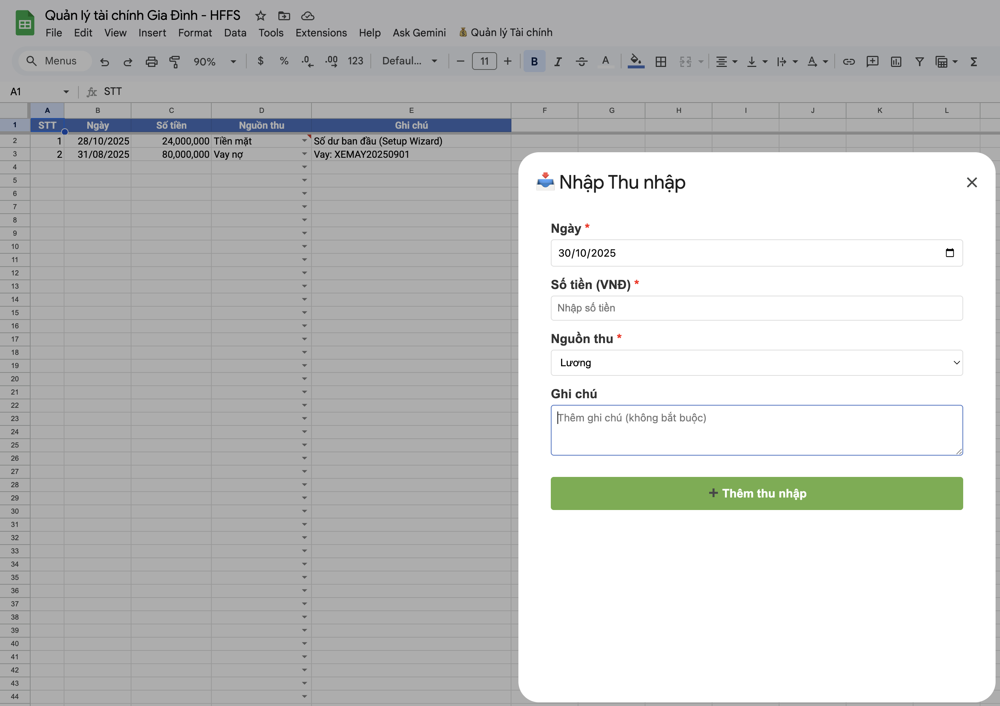
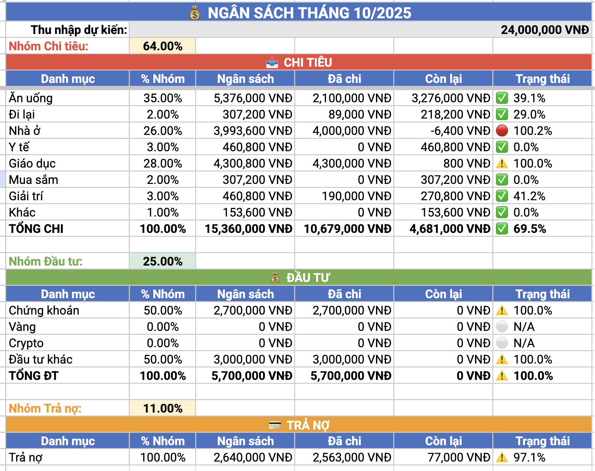

# HODLVN-Family-Finance 🏠💰

[](https://github.com/tohaitrieu/HODLVN-Family-Finance)
[](LICENSE)
[](https://script.google.com)
[]()

Hệ thống quản lý tài chính cá nhân và gia đình toàn diện được xây dựng trên Google Sheets và Google Apps Script, được thiết kế đặc biệt cho người Việt Nam.

---

## 📑 MỤC LỤC

1. [Giới thiệu](#-giới-thiệu)
2. [Tính năng chính](#-tính-năng-chính)
3. [Yêu cầu hệ thống](#-yêu-cầu-hệ-thống)
4. [Cài đặt nhanh](#-cài-đặt-nhanh)
5. [Cấu trúc dự án](#-cấu-trúc-dự-án)
6. [Kiến trúc hệ thống](#-kiến-trúc-hệ-thống)
7. [Tài liệu chi tiết](#-tài-liệu-chi-tiết)
8. [Screenshots](#-screenshots)
9. [Roadmap](#-roadmap)
10. [Đóng góp](#-đóng-góp)
11. [Giấy phép](#-giấy-phép)
12. [Liên hệ](#-liên-hệ)

---

## 🎯 Giới thiệu

**HODLVN-Family-Finance** là một hệ thống quản lý tài chính gia đình hoàn chỉnh, được phát triển trên nền tảng Google Sheets và Google Apps Script. Hệ thống giúp bạn:

- ✅ Theo dõi thu chi hàng ngày một cách tự động
- ✅ Quản lý các khoản nợ và lịch trả nợ
- ✅ Theo dõi danh mục đầu tư (chứng khoán, vàng, crypto, đầu tư khác)
- ✅ Lập kế hoạch ngân sách và cảnh báo chi tiêu
- ✅ Phân tích tài chính qua Dashboard trực quan
- ✅ Tính toán dòng tiền (Cash Flow) tự động

### Tại sao chọn HODLVN-Family-Finance?

- 🇻🇳 **Hoàn toàn tiếng Việt**: Giao diện và thuật ngữ được bản địa hóa
- 🆓 **Miễn phí 100%**: Sử dụng Google Sheets - không tốn phí
- 🔒 **Bảo mật**: Dữ liệu được lưu trữ trên Google Drive cá nhân
- 📱 **Đa nền tảng**: Truy cập từ web, mobile, desktop
- 🎨 **Dễ sử dụng**: Giao diện thân thiện với form nhập liệu trực quan
- 🔧 **Mã nguồn mở**: Tùy chỉnh theo nhu cầu riêng

---

## ⭐ Tính năng chính

### 1. **Quản lý Thu Chi**
- 📥 **Thu nhập (THU)**: Ghi nhận các nguồn thu (lương, thưởng, thu nhập phụ...)
- 📤 **Chi tiêu (CHI)**: Theo dõi chi phí theo danh mục (ăn uống, đi lại, học tập...)
- 💰 **Tính Cash Flow tự động**: Thu - (Chi + Trả nợ + Đầu tư)

### 2. **Quản lý Nợ**
- 📋 **Quản lý nợ (QUẢN LÝ NỢ)**: Ghi nhận các khoản vay
- 💳 **Trả nợ (TRẢ NỢ)**: Theo dõi lịch trả nợ, tính gốc + lãi
- 🔄 **Tự động tạo thu nhập**: Khi vay nợ, hệ thống tự tạo khoản thu "Vay [Loại nợ]"
- ⚠️ **Cảnh báo nợ**: Nhắc nhở khoản nợ sắp đến hạn

### 3. **Quản lý Đầu tư**

#### 📈 Chứng khoán (CHỨNG KHOÁN)
- Mua/bán cổ phiếu
- Theo dõi lãi/lỗ
- Quản lý margin (vay ký quỹ)
- Nhận cổ tức

#### 🪙 Vàng (VÀNG)
- Mua/bán vàng
- Theo dõi giá trị hiện tại
- Tính lãi/lỗ

#### ₿ Cryptocurrency (CRYPTO)
- Mua/bán crypto
- Đa loại tiền ảo
- Theo dõi portfolio

#### 💼 Đầu tư khác (ĐẦU TƯ KHÁC)
- Bất động sản
- Quỹ đầu tư
- Trái phiếu
- Các kênh đầu tư khác

#### 💵 Cổ tức (CỔ TỨC)
- Ghi nhận cổ tức nhận được
- Tự động cập nhật Cash Flow

### 4. **Ngân sách (BUDGET)**
- 🎯 Đặt mục tiêu chi tiêu theo danh mục
- 🎯 Đặt mục tiêu đầu tư
- 🚦 Cảnh báo 3 cấp độ:
  - 🟢 **Xanh**: < 70% ngân sách
  - 🟡 **Vàng**: 70-90% ngân sách
  - 🔴 **Đỏ**: > 90% ngân sách
- 📊 Tự động cập nhật sau mỗi giao dịch

### 5. **Dashboard & Báo cáo**
- 📊 Tổng quan tài chính realtime
- 📈 Biểu đồ phân tích thu chi
- 💹 Hiệu suất đầu tư
- 📅 Phân tích theo kỳ (tuần/tháng/quý/năm)
- 🔍 So sánh giữa các kỳ

### 6. **Setup Wizard**
- 🚀 Khởi tạo hệ thống nhanh chóng
- 📝 Thu thập thông tin người dùng
- ⚙️ Cấu hình tham số ban đầu
- 🎨 Tùy chỉnh danh mục

---

## 💻 Yêu cầu hệ thống

### Bắt buộc
- ✅ Tài khoản Google (Gmail)
- ✅ Truy cập Google Sheets
- ✅ Truy cập Google Apps Script
- ✅ Trình duyệt web hiện đại (Chrome, Firefox, Edge, Safari)

### Khuyến nghị
- 📱 Cài đặt Google Sheets App trên điện thoại
- 🌐 Kết nối internet ổn định
- 💾 Dung lượng Google Drive đủ (< 100MB)

### Quyền truy cập cần thiết
Hệ thống yêu cầu các quyền sau:
- 📄 Đọc/Ghi Google Sheets
- 🖥️ Hiển thị giao diện HTML
- 📊 Truy cập dữ liệu Spreadsheet

---

## 🚀 Cài đặt nhanh

### Bước 1: Tạo bản sao Google Sheet

```
1. Mở link Google Sheet mẫu (sẽ cập nhật)
2. File → Make a copy
3. Đặt tên: "HODLVN-Family-Finance - [Tên bạn]"
4. Chọn vị trí lưu trên Google Drive
```

### Bước 2: Cấu hình Apps Script

```
1. Mở Google Sheet vừa tạo
2. Extensions → Apps Script
3. Copy toàn bộ code từ thư mục /src
4. Lưu dự án (Ctrl + S)
5. Chạy function setup() lần đầu
6. Cấp quyền truy cập khi được yêu cầu
```

### Bước 3: Chạy Setup Wizard

```
1. Quay lại Google Sheet
2. Menu "HODLVN Finance" sẽ xuất hiện
3. Chọn "🚀 Setup Wizard"
4. Điền thông tin cá nhân
5. Nhấn "Khởi tạo hệ thống"
```

### Bước 4: Bắt đầu sử dụng

```
1. Chọn menu "HODLVN Finance"
2. Chọn loại giao dịch muốn nhập
3. Điền form và Submit
4. Xem Dashboard để theo dõi
```

**📖 Hướng dẫn chi tiết:** [Xem INSTALLATION.md](docs/INSTALLATION.md)

---

## 📂 Cấu trúc dự án

```
HODLVN-Family-Finance/
│
├── README.md                          # File này
├── LICENSE                            # Giấy phép MIT
│
├── docs/                              # Tài liệu
│   ├── INSTALLATION.md                # Hướng dẫn cài đặt chi tiết
│   ├── USER_GUIDE.md                  # Hướng dẫn sử dụng
│   ├── TECHNICAL_DOCUMENTATION.md     # Tài liệu kỹ thuật
│   ├── CHANGELOG.md                   # Lịch sử phiên bản
│   └── TROUBLESHOOTING.md             # Xử lý sự cố
│
├── src/                               # Mã nguồn Google Apps Script
│   ├── Main.gs                        # Menu và dispatcher
│   ├── SheetInitializer.gs            # Khởi tạo sheets
│   ├── DataProcessor.gs               # Xử lý giao dịch
│   ├── BudgetManager.gs               # Quản lý ngân sách
│   ├── DashboardManager.gs            # Dashboard analytics
│   └── Utils.gs                       # Hàm tiện ích
│
├── forms/                             # HTML Forms
│   ├── IncomeForm.html                # Form thu nhập
│   ├── ExpenseForm.html               # Form chi tiêu
│   ├── DebtManagementForm.html        # Form quản lý nợ
│   ├── DebtPaymentForm.html           # Form trả nợ
│   ├── StockForm.html                 # Form chứng khoán
│   ├── GoldForm.html                  # Form vàng
│   ├── CryptoForm.html                # Form crypto
│   ├── OtherInvestmentForm.html       # Form đầu tư khác
│   ├── DividendForm.html              # Form cổ tức
│   └── SetupWizard.html               # Setup Wizard
│
└── templates/                         # Mẫu Google Sheet
    └── HODLVN-Finance-Template.xlsx   # Template sheet
```

---

## 🏗️ Kiến trúc hệ thống

### Kiến trúc v3.0 (Modular Architecture)

```
┌─────────────────────────────────────────────────────────┐
│                    GOOGLE SHEETS UI                      │
│              (10 Sheets + Dashboard)                     │
└────────────────────┬────────────────────────────────────┘
                     │
┌────────────────────▼────────────────────────────────────┐
│                   MAIN MENU (Main.gs)                    │
│              Menu Dispatcher & Router                    │
└─┬──────────┬──────────┬──────────┬──────────┬──────────┘
  │          │          │          │          │
┌─▼────┐ ┌──▼────┐ ┌───▼────┐ ┌───▼────┐ ┌──▼────┐
│Sheet │ │ Data  │ │ Budget │ │Dashboard│ │ Utils │
│Init  │ │Process│ │Manager │ │Manager  │ │       │
└──────┘ └───────┘ └────────┘ └─────────┘ └───────┘
```

### Modules (v3.0)

| Module | File | Chức năng |
|--------|------|-----------|
| **Menu Dispatcher** | `Main.gs` | Tạo menu, điều hướng giữa các chức năng |
| **Sheet Initializer** | `SheetInitializer.gs` | Tạo và cấu hình sheets, Setup Wizard |
| **Data Processor** | `DataProcessor.gs` | Xử lý các loại giao dịch (THU, CHI, NỢ, ĐẦU TƯ) |
| **Budget Manager** | `BudgetManager.gs` | Quản lý ngân sách, cảnh báo chi tiêu |
| **Dashboard Manager** | `DashboardManager.gs` | Tạo báo cáo, analytics, dashboard |
| **Utilities** | `Utils.gs` | Hàm tiện ích dùng chung |

### 10 Loại Sheets

| Sheet | Mã | Mục đích |
|-------|-----|----------|
| **Thu nhập** | THU | Ghi nhận các khoản thu |
| **Chi tiêu** | CHI | Ghi nhận các khoản chi |
| **Quản lý nợ** | QUẢN LÝ NỢ | Danh sách các khoản nợ |
| **Trả nợ** | TRẢ NỢ | Lịch sử trả nợ |
| **Chứng khoán** | CHỨNG KHOÁN | Giao dịch cổ phiếu |
| **Vàng** | VÀNG | Giao dịch vàng |
| **Cryptocurrency** | CRYPTO | Giao dịch tiền ảo |
| **Đầu tư khác** | ĐẦU TƯ KHÁC | Các kênh đầu tư khác |
| **Cổ tức** | CỔ TỨC | Cổ tức nhận được |
| **Ngân sách** | BUDGET | Kế hoạch và theo dõi ngân sách |
| **Dashboard** | DASHBOARD | Tổng quan và báo cáo |

---

## 📚 Tài liệu chi tiết

| Tài liệu | Mô tả | Link |
|----------|-------|------|
| 📥 **Installation Guide** | Hướng dẫn cài đặt từng bước chi tiết | [INSTALLATION.md](docs/INSTALLATION.md) |
| 📖 **User Guide** | Hướng dẫn sử dụng các tính năng | [USER_GUIDE.md](docs/USER_GUIDE.md) |
| 🔧 **Technical Docs** | Tài liệu kỹ thuật cho developers | [TECHNICAL_DOCUMENTATION.md](docs/TECHNICAL_DOCUMENTATION.md) |
| 📝 **Changelog** | Lịch sử phát triển và cập nhật | [CHANGELOG.md](docs/CHANGELOG.md) |
| 🔍 **Troubleshooting** | Xử lý lỗi và FAQ | [TROUBLESHOOTING.md](docs/TROUBLESHOOTING.md) |

---

## 📸 Screenshots

### Dashboard Tổng quan

*Dashboard hiển thị tổng quan tài chính realtime*

### Form Nhập liệu

*Form nhập thu nhập với validation tự động*

### Budget Tracking

*Theo dõi ngân sách với cảnh báo màu sắc*

### Setup Wizard

*Setup Wizard giúp khởi tạo hệ thống nhanh chóng*

---

## 🗺️ Roadmap

### Version 3.0 (Current) ✅
- [x] Kiến trúc modular
- [x] 10 loại giao dịch
- [x] Setup Wizard
- [x] Budget tracking với 3 cấp cảnh báo
- [x] Dashboard realtime
- [x] Tính Cash Flow tự động
- [x] Fix bug appendRow với pre-filled formulas

### Version 3.1 (Q1 2026) 🚧
- [ ] Export/Import dữ liệu Excel
- [ ] Backup tự động lên Google Drive
- [ ] Templates ngân sách theo mục đích (gia đình, cá nhân, doanh nghiệp)
- [ ] Multi-currency support (USD, EUR, VND)
- [ ] Dark mode

### Version 3.2 (Q2 2026) 📋
- [ ] Mobile app (Progressive Web App)
- [ ] Notifications qua email/SMS
- [ ] Tích hợp API giá vàng/chứng khoán realtime
- [ ] AI insights và recommendations
- [ ] Sharing và collaboration (nhiều người dùng)

### Version 4.0 (Future) 🔮
- [ ] Machine Learning dự đoán chi tiêu
- [ ] Chatbot hỗ trợ
- [ ] Tích hợp ngân hàng (banking API)
- [ ] Phân tích thuế tự động
- [ ] Community marketplace (chia sẻ templates)

---

## 🤝 Đóng góp

Chúng tôi rất hoan nghênh mọi đóng góp từ cộng đồng!

### Cách đóng góp

1. **Fork** dự án
2. Tạo **branch** mới (`git checkout -b feature/AmazingFeature`)
3. **Commit** thay đổi (`git commit -m 'Add some AmazingFeature'`)
4. **Push** lên branch (`git push origin feature/AmazingFeature`)
5. Mở **Pull Request**

### Báo lỗi (Bug Report)

Nếu bạn tìm thấy lỗi, vui lòng:
1. Kiểm tra [Issues](https://github.com/tohaitrieu/HODLVN-Family-Finance/issues) xem đã có ai báo cáo chưa
2. Nếu chưa, tạo Issue mới với:
   - Mô tả lỗi rõ ràng
   - Các bước tái hiện lỗi
   - Screenshots (nếu có)
   - Version đang sử dụng

### Đề xuất tính năng

Có ý tưởng hay? Tạo [Feature Request](https://github.com/tohaitrieu/HODLVN-Family-Finance/issues/new?template=feature_request.md)

### Code Style

- Sử dụng tiếng Việt cho comments và tên biến quan trọng
- Tuân thủ [Google Apps Script Style Guide](https://developers.google.com/apps-script/guides/style)
- Viết documentation cho functions mới
- Thêm unit tests nếu có thể

---

## 📄 Giấy phép

Dự án này được phân phối dưới giấy phép **MIT License**. Xem file [LICENSE](LICENSE) để biết thêm chi tiết.

```
MIT License

Copyright (c) 2025 HODLVN-Family-Finance

Permission is hereby granted, free of charge, to any person obtaining a copy
of this software and associated documentation files (the "Software"), to deal
in the Software without restriction...
```

---

## 📧 Liên hệ

### Tác giả
- **Tô Triều** - *Founder & Lead Developer*
- GitHub: [@tohaitrieu](https://github.com/tohaitrieu)
- Email: contact@tohaitrieu.net

### Cộng đồng
- 💬 [Facebook Group](https://facebook.com/groups/hodl.vn) - Thảo luận và hỗ trợ
- 🐦 [Twitter](https://twitter.com/tohaitrieu) - Cập nhật tin tức
- 📺 [YouTube](https://youtube.com/@totrieu) - Video hướng dẫn
- 📱 [Telegram](https://t.me/totrieutrading) - Chat trực tiếp

### Support
Nếu dự án hữu ích, hãy:
- ⭐ **Star** repository
- 🍴 **Fork** và chia sẻ với bạn bè
- 📢 **Share** trên mạng xã hội
- ☕ **Buy me a coffee**: [PayPal](https://paypal.me/tohaitrieu)

---

## 🙏 Lời cảm ơn

Dự án này được lấy cảm hứng từ:
- Cộng đồng quản lý tài chính Việt Nam
- Google Apps Script Developer Community
- Open Source Financial Tools

Cảm ơn tất cả contributors đã đóng góp vào dự án! 🎉

---

## 📊 Thống kê


---

<div align="center">

**Được phát triển với ❤️ cho cộng đồng Việt Nam**

[⬆ Về đầu trang](#hodlvn-family-finance-)