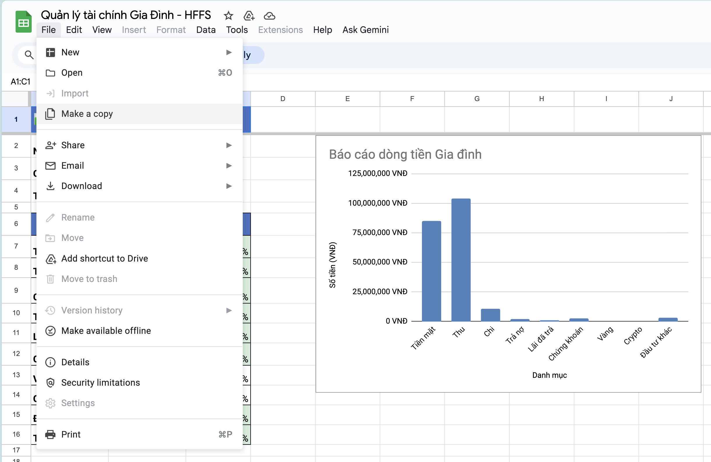
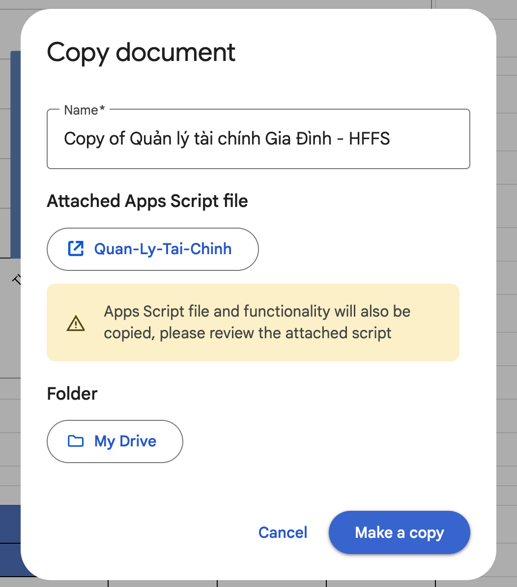
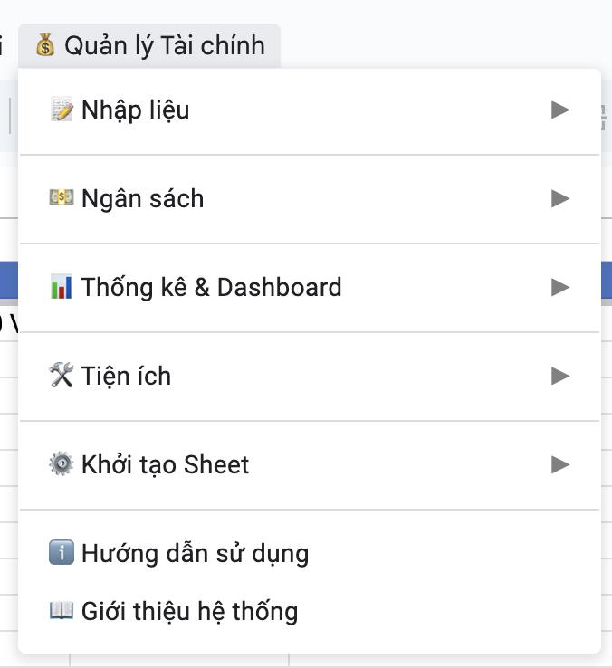
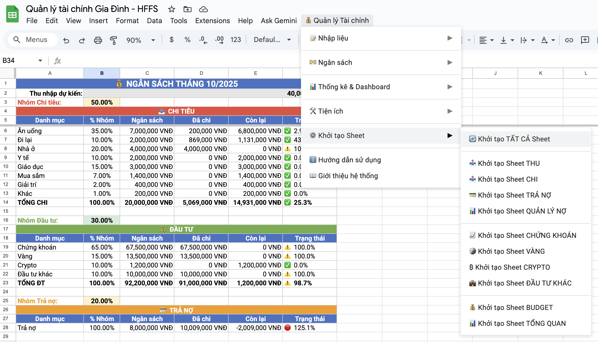
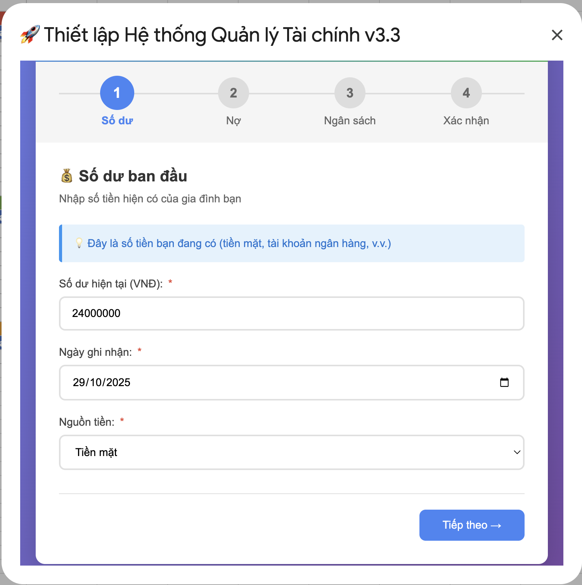
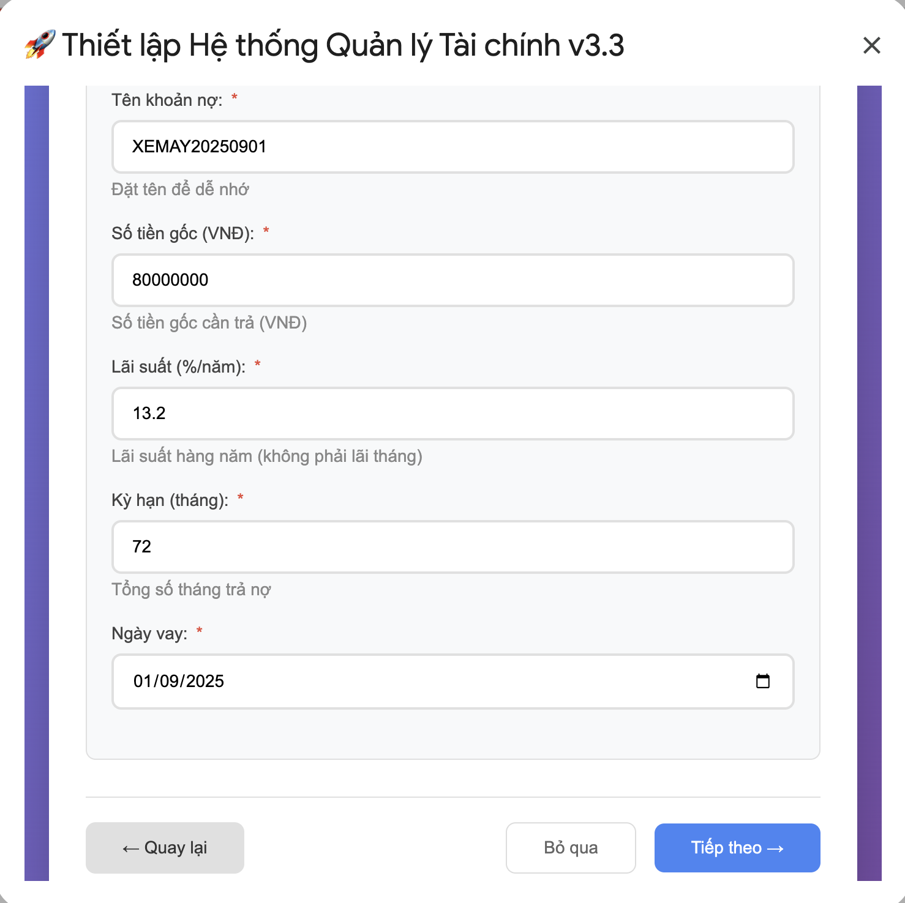
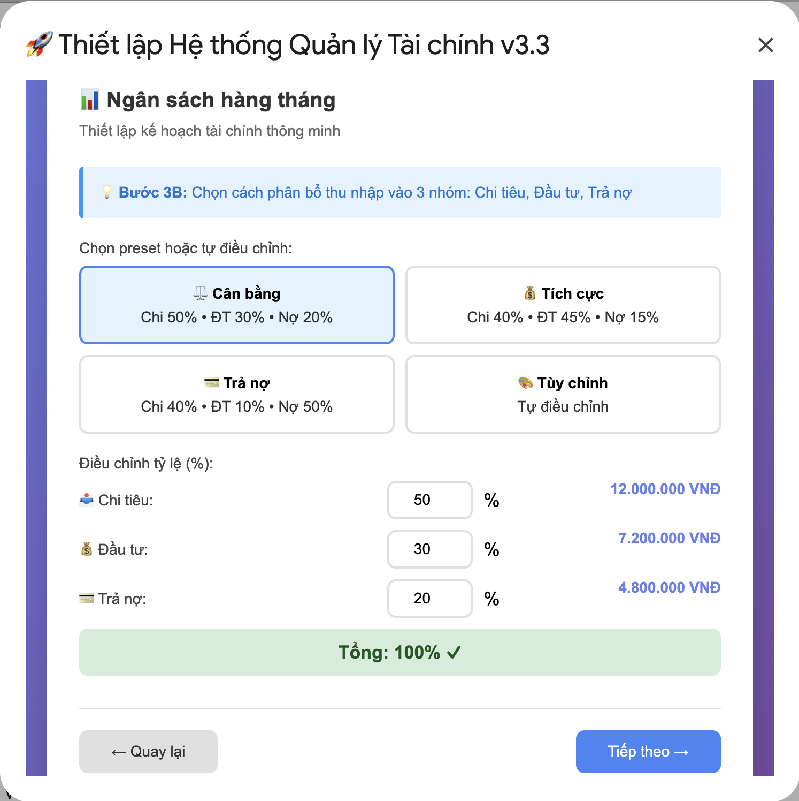
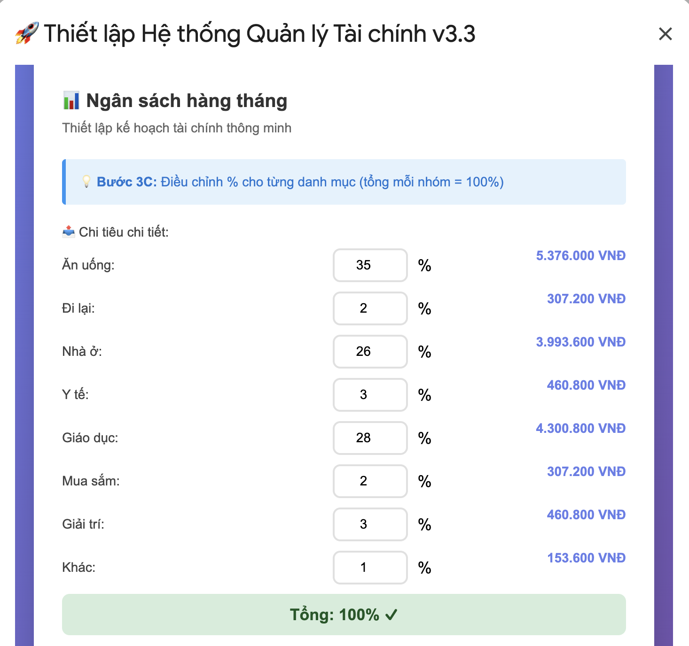
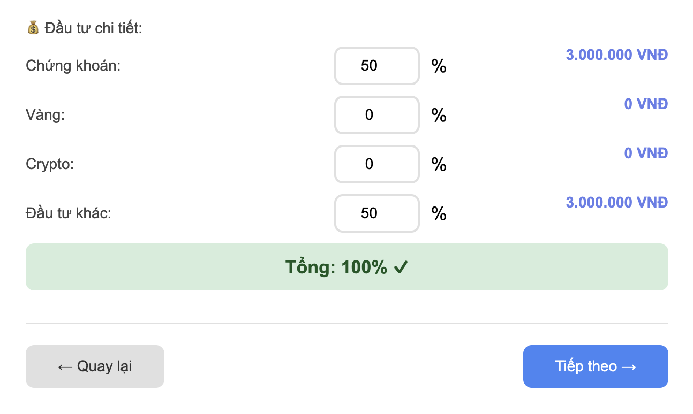
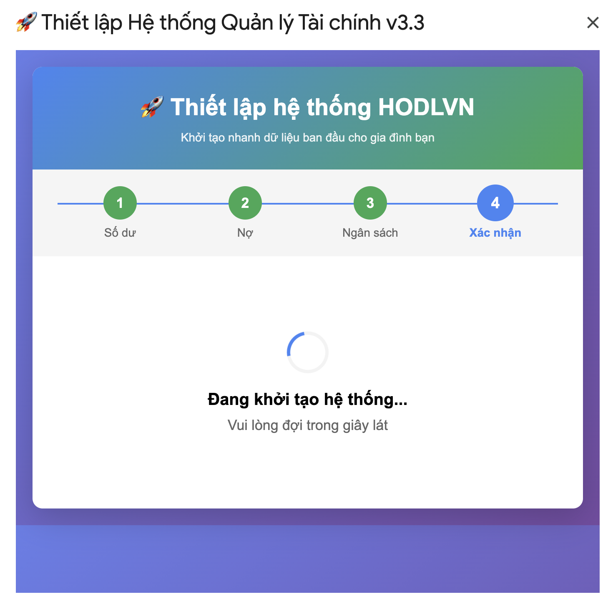

# 📥 HƯỚNG DẪN CÀI ĐẶT - HODLVN-Family-Finance

Hướng dẫn cài đặt chi tiết hệ thống quản lý tài chính gia đình từ A đến Z.

---

## 📑 MỤC LỤC

1. [Tổng quan](#-tổng-quan)
2. [Yêu cầu trước khi cài đặt](#-yêu-cầu-trước-khi-cài-đặt)
3. [Phương pháp cài đặt](#-phương-pháp-cài-đặt)
   - [Phương pháp 1: Sao chép Template (Đơn giản)](#phương-pháp-1-sao-chép-template-đơn-giản-khuyến-nghị)
   - [Phương pháp 2: Cài đặt từ đầu (Nâng cao)](#phương-pháp-2-cài-đặt-từ-đầu-nâng-cao)
4. [Cấu hình Google Apps Script](#-cấu-hình-google-apps-script)
5. [Chạy Setup Wizard](#-chạy-setup-wizard)
6. [Cấu hình nâng cao](#-cấu-hình-nâng-cao)
7. [Kiểm tra và xác minh](#-kiểm-tra-và-xác-minh)
8. [Xử lý lỗi thường gặp](#-xử-lý-lỗi-thường-gặp)
9. [Video hướng dẫn](#-video-hướng-dẫn)
10. [Checklist cài đặt](#-checklist-cài-đặt)
11. [Câu hỏi thường gặp](#-câu-hỏi-thường-gặp)

---

## 🎯 Tổng quan

### Thời gian cài đặt

| Phương pháp | Thời gian | Độ khó | Phù hợp với |
|-------------|-----------|--------|-------------|
| **Template** | 5-10 phút | ⭐ Dễ | Người dùng thông thường |
| **Từ đầu** | 30-45 phút | ⭐⭐⭐ Khó | Developers, người muốn tùy chỉnh |

### Quy trình tổng quan

```
1. Chuẩn bị → 2. Tạo Google Sheet → 3. Cài Apps Script → 4. Setup Wizard → 5. Hoàn thành
   (2 phút)      (3 phút)              (5 phút)           (3 phút)         (2 phút)
```

---

## ✅ Yêu cầu trước khi cài đặt

### 1. Tài khoản Google

**Bắt buộc:**
- ✅ Tài khoản Gmail hoạt động
- ✅ Đã đăng nhập vào Google Drive
- ✅ Có quyền tạo và chỉnh sửa Google Sheets

**Khuyến nghị:**
- 📱 Bật xác thực 2 bước (2FA) để bảo mật
- 💾 Đảm bảo còn ít nhất 100MB dung lượng Drive
- 🔒 Xem xét sử dụng tài khoản riêng cho tài chính

### 2. Trình duyệt

**Được hỗ trợ:**
- ✅ Google Chrome (phiên bản 90+)
- ✅ Microsoft Edge (phiên bản 90+)
- ✅ Mozilla Firefox (phiên bản 88+)
- ✅ Safari (phiên bản 14+)

**Không được hỗ trợ:**
- ❌ Internet Explorer
- ❌ Trình duyệt cũ (< 2020)

### 3. Kết nối Internet

- 🌐 Tốc độ tối thiểu: 2 Mbps
- 📶 Kết nối ổn định trong quá trình cài đặt
- ⏱️ Latency thấp để tương tác mượt mà

### 4. Kiến thức cơ bản

**Cho người dùng thông thường (Phương pháp 1):**
- 📊 Biết cách sử dụng Google Sheets cơ bản
- 🖱️ Copy/Paste, điền form

**Cho Developers (Phương pháp 2):**
- 💻 Hiểu cơ bản về Google Apps Script
- 📝 Biết JavaScript
- 🔧 Có kinh nghiệm debug code

---

## 🚀 Phương pháp cài đặt

---

## Phương pháp 1: Sao chép Template (Đơn giản) - KHUYẾN NGHỊ

### Bước 1: Truy cập Template

#### 1.1. Mở link Template

```
👉 Link Template: https://docs.google.com/spreadsheets/d/1rXd7BA1chHwi7z4Sz0g_U6YOQoEX92NljejWG_4mpWw/edit?usp=sharing
(Link sẽ được cập nhật khi release)
```

**Lưu ý:** Template đã có sẵn:
- ✅ Toàn bộ code Apps Script
- ✅ 10 sheets được cấu hình
- ✅ Formulas đã được thiết lập
- ✅ Forms HTML sẵn sàng

#### 1.2. Xem quyền truy cập

Đảm bảo bạn thấy thông báo:
```
"Chế độ xem" hoặc "View only"
```

Nếu gặp lỗi "Access denied":
- 🔍 Kiểm tra link có chính xác không
- 🔐 Đảm bảo đã đăng nhập đúng tài khoản Gmail

---

### Bước 2: Tạo bản sao

#### 2.1. Sao chép file

1. Click **File** (góc trên bên trái)
2. Chọn **Make a copy** (hoặc **Tạo bản sao**)



3. Bấm nút Make a Copy trong cửa sổ tiếp theo



#### 2.2. Đặt tên file

```
Tên đề xuất: HFFS-[Tên bạn]-2025
Ví dụ: HFFS-NikaFamily-2025
```

**Lưu ý đặt tên:**
- ✅ Có thể chứa tiếng Việt có dấu
- ✅ Nên thêm năm để dễ quản lý
- ✅ Tránh ký tự đặc biệt: `/ \ : * ? " < > |`

#### 2.3. Chọn vị trí lưu

```
📁 Đề xuất: 
   My Drive
   └── Tài chính gia đình
       └── HFFS-NikaFamily-2025
```

**Tạo folder mới (nếu chưa có):**
1. Click "Organize" hoặc "Folder" icon
2. New folder → "Tài chính gia đình"
3. Select folder vừa tạo

#### 2.4. Hoàn tất sao chép

1. Click **Make a copy** (màu xanh)
2. Đợi 5-10 giây
3. File mới sẽ tự động mở

✅ **Bạn đã có bản sao riêng!**

---

### Bước 3: Kích hoạt Scripts

#### 3.1. Chạy function đầu tiên

Khi mở file lần đầu, bạn sẽ thấy:

```
⚠️ Authorization Required
```

**Thực hiện:**

1. Đợi menu "Quản lý Tài Chính" xuất hiện (10-20 giây)
2. Nếu menu không xuất hiện:
   - Extensions → Apps Script
   - Chọn function `onOpen`
   - Click ▶️ Run


#### 3.2. Cấp quyền truy cập

Sẽ có popup:

```
⚠️ Authorization needed
This project wants to:
- View and manage your spreadsheets
- Display and run content from the web
```

**Các bước cấp quyền:**

1. Click **Review permissions** (Xem lại quyền)
2. Chọn tài khoản Google của bạn
3. Nếu thấy cảnh báo:

```
⚠️ Google hasn't verified this app
```

**Không sao! Đây là app của bạn.**

4. Click **Advanced** (Nâng cao)
5. Click **Go to [Project Name] (unsafe)**
6. Click **Allow** (Cho phép)


**Giải thích:**
- 🔒 Apps Script chưa verify vì là project cá nhân
- ✅ An toàn 100% vì code do bạn kiểm soát
- 🔐 Chỉ bạn có quyền truy cập

#### 3.3. Kiểm tra menu

Sau khi cấp quyền, refresh trang (F5):

```
Menu "Quản lý Tài chính" xuất hiện ✅
```

Menu bao gồm:



---

### Bước 4: Chạy Setup Wizard

#### 4.1. Mở Setup Wizard

```
Menu "Quản lý Tài chính" → "🚀 Khởi tạo Sheet"
```



Một cửa sổ popup sẽ hiện lên.



#### 4.2. Điền thông tin số dư ban đầu

Nhập số dư tiền mặt hiện tại của bạn.


Các mục nhập:

- Số tiền: Số dư hiện tại
- Ngày ghi nhận: Ngày khởi tạo file hoặc do bạn lựa chọn.
- Nguồn tiền: Tiền mặt, tài khoản ngân hàng, Ví Momo…

#### 4.3. Thông tin vay nợ

Hệ thống cho phép chọn nhập khoản nợ đầu tiên, hoặc sẽ nhập sau.



Các mục nhập: 

- Tên khoản nợ: Nên đặt mã hóa bao gồm tên - năm/tháng/ngày để dễ quản lý và dễ hiểu. Ví dụ: XEMAY20250901 = Khoản vay mua xe máy ngày 01/09/2025.
- Số tiền gốc: Số tiền vay
- Lãi suất: Lãi suất vay thực tế
- Kỳ hạn: Kỳ hạn khoản vay
- Ngày vay: Ngày bắt đầu giải ngân khoản vay

#### 4.4. Lập ngân sách chi tiêu - Đầu tư

Hệ thống đặt mặc định một số mô hình phân bổ thu nhập, trong đó Cân bằng là Hệ thoogns 5-3-2 nổi tiếng trên thế giới.

Bạn có thể chọn tùy chỉnh để phù hợp với hoàn cảnh gia đình



> **Lưu ý**: Ở các bước tiếp theo các khoản chi tiêu, đầu tư sẽ dựa trên tỷ lệ này. Ví dụ: Nếu bạn kiếm được 10 đồng và chi tiêu 5 đồng, thì khi tính tỷ lệ ăn uống sẽ là **tỷ lệ theo 5 đồng**, không phải tỷ lệ theo tổng thu nhập.

**Ngân sách cơ bản**

Đây là phần thiết lập tỷ lệ cho nhu cầu thiết yếu - cơ bản nhất trong cuộc sống hàng ngày, hãy tính toán chi tiết:



Ở bước trước đó, nếu bạn kiếm được 10 đồng và chọn Tiêu 5 đồng, thì tổng 100% ở bước này tương ứng với 5 đồng.

Tiếp tục kéo xuống để thiết lập ngân sách đầu tư.



Do trả nợ nếu vay trả góp là cố định hoặc chọn tỷ lệ là 50% cho các khoản nợ, vì vậy chúng ta không thiết lập chi tiết mà hệ thống sẽ tự tính toán.

#### 4.5. Thu nhập dự kiến

Đây là thu nhập trung bình mỗi tháng của gia đình bạn và số liệu này sẽ được sử dụng cho việc phân bổ ngân sách phía trên


Giả định như Chị Dậu có thu nhập gia đình là 24.000.000đ/tháng.

Bấm tiếp theo để xem lại toàn bộ quá trình nhập, quay lại để thiết lập lại.
#### 4.6. Khởi tạo hệ thống



1. Click **"Khởi tạo hệ thống"**
2. Đợi 10-15 giây
3. Thông báo thành công:

```
✅ Khởi tạo thành công!
Hệ thống đã sẵn sàng sử dụng.
```

#### 4.4. Xác minh

Kiểm tra các tabs:
- ✅ Dashboard có tên bạn
- ✅ 10 sheets đã được tạo
- ✅ Budget sheet có cấu trúc

---

### Bước 5: Hoàn thành 🎉

**Xin chúc mừng! Bạn đã cài đặt thành công.**

**Bước tiếp theo:**
1. 📖 Đọc [USER_GUIDE.md](USER_GUIDE.md) để học cách sử dụng
2. 💰 Nhập giao dịch đầu tiên
3. 📊 Xem Dashboard

---


---

## 🎥 Video hướng dẫn

### Video chính thức

| Video | Nội dung | Thời lượng | Link |
|-------|----------|------------|------|
| 📺 **Cài đặt cơ bản** | Hướng dẫn cài đặt từ template | 10 phút | [Xem video](#) |
| 📺 **Setup Wizard** | Chi tiết cấu hình ban đầu | 8 phút | [Xem video](#) |
| 📺 **Nhập giao dịch** | Cách sử dụng forms | 12 phút | [Xem video](#) |
| 📺 **Dashboard** | Đọc hiểu báo cáo tài chính | 15 phút | [Xem video](#) |
| 📺 **Troubleshooting** | Xử lý lỗi thường gặp | 10 phút | [Xem video](#) |

### Playlist YouTube

```
🎬 HFFS Tutorial Series
https://youtube.com/playlist?list=YOUR_PLAYLIST_ID

- Video 1: Giới thiệu tổng quan
- Video 2: Cài đặt chi tiết
- Video 3: Sử dụng cơ bản
- Video 4: Tính năng nâng cao
- Video 5: Tips & Tricks
```

---

## ✅ Checklist cài đặt

### Pre-installation checklist

```
□ Có tài khoản Gmail
□ Đăng nhập Google Drive
□ Trình duyệt Chrome/Edge mới nhất
□ Kết nối internet ổn định
□ Đã đọc tài liệu cài đặt
```

### Installation checklist (Template method)

```
□ Mở link Template
□ Make a copy
□ Đặt tên file
□ Chọn vị trí lưu
□ File copy thành công
□ Menu Quản lý Tài chính hiển thị
□ Chạy Setup Wizard
□ Điền thông tin đầy đủ
□ Khởi tạo thành công
□ Kiểm tra 11 sheets đã tạo
```

### Post-installation checklist

```
□ Test form Thu nhập
□ Test form Chi tiêu
□ Kiểm tra Dashboard cập nhật
□ Kiểm tra Budget hoạt động
□ Test ít nhất 1 loại đầu tư
□ Kiểm tra Cash Flow tính toán
□ Set up danh mục riêng (nếu cần)
□ Đọc User Guide
□ Bookmark file để truy cập nhanh
□ Backup file (optional)
```

### Advanced configuration checklist

```
□ Tùy chỉnh danh mục
□ Cấu hình màu sắc
□ Set up auto-backup (nếu cần)
□ Thêm custom formulas (nếu cần)
□ Cấu hình triggers
□ Set up notifications (nếu cần)
```

---

## ❓ Câu hỏi thường gặp

### Q1: Có mất phí không?

**A:** Không, hoàn toàn miễn phí!
- ✅ Google Sheets miễn phí
- ✅ Google Apps Script miễn phí
- ✅ Code mã nguồn mở miễn phí

### Q2: Dữ liệu có bảo mật không?

**A:** Có, rất bảo mật!
- 🔒 Lưu trữ trên Google Drive cá nhân
- 🔐 Chỉ bạn có quyền truy cập
- 🔒 Google có mã hóa end-to-end
- 🔐 Không ai khác thấy được data

### Q3: Có thể dùng trên điện thoại không?

**A:** Có!
- 📱 Cài Google Sheets app
- 📱 Mở file trên app
- 📱 Forms tương thích mobile
- 📱 Dashboard responsive

### Q4: Có thể share với người khác không?

**A:** Có nhưng cẩn thận!
- ✅ Click "Share" trong Google Sheet
- ✅ Add email người dùng
- ⚠️ Cân nhắc quyền Editor hay Viewer
- 🔒 Dữ liệu tài chính nhạy cảm!

### Q5: Làm sao backup dữ liệu?

**A:** Nhiều cách:
```
Cách 1: Manual copy
- File → Make a copy

Cách 2: Download
- File → Download → Excel (.xlsx)

Cách 3: Auto-backup
- Cấu hình trigger (xem phần Cấu hình nâng cao)
```

### Q6: Có giới hạn số giao dịch không?

**A:** Không!
- ✅ Google Sheets hỗ trợ 10 triệu cells
- ✅ Với 10 columns, được ~1 triệu rows
- ✅ Đủ cho hàng chục năm sử dụng

### Q7: Làm sao update version mới?

**A:** 2 cách:
```
Cách 1: Copy code mới vào Apps Script
- So sánh CHANGELOG
- Copy các file thay đổi
- Test kỹ

Cách 2: Make copy file mới, import data cũ
- Copy template mới
- Export data từ file cũ
- Import vào file mới
```

### Q8: Có thể tùy chỉnh không?

**A:** Có hoàn toàn!
- ✅ Code mã nguồn mở
- ✅ Chỉnh sửa thoải mái
- ✅ Thêm tính năng riêng
- ✅ Thay đổi giao diện

### Q9: Có support không?

**A:** Có nhiều kênh:
```
- 📖 Đọc documentation
- 🔍 Xem Troubleshooting
- 💬 Facebook Group
- 📧 Email hỗ trợ
- 🐛 GitHub Issues
```

### Q10: Làm sao xóa và bắt đầu lại?

**A:** Rất đơn giản:
```
1. Delete file Google Sheet
2. Make copy template mới
3. Chạy Setup Wizard
4. Done!
```

---

## 📞 Hỗ trợ cài đặt

### Khi cần trợ giúp

**Trước khi hỏi, hãy:**
1. ✅ Đọc kỹ hướng dẫn này
2. ✅ Xem phần Troubleshooting
3. ✅ Check các video hướng dẫn
4. ✅ Xem logs trong Apps Script

**Liên hệ hỗ trợ:**
- 💬 Facebook Group: [https://www.facebook.com/groups/hodl.vn]
- 📧 Email: contact@tohaitrieu.net
- 🐛 GitHub Issues: [https://github.com/tohaitrieu/HODLVN-Family-Finance/issues]
- 📱 Telegram: [https://t.me/totrieu]

**Khi báo lỗi, cung cấp:**
- 📋 Version đang dùng
- 💻 Trình duyệt + OS
- 📸 Screenshot lỗi
- 📝 Các bước đã làm
- 📊 Logs từ Apps Script (nếu có)

---

## 🎉 Hoàn thành

**Xin chúc mừng!** Bạn đã hoàn thành việc cài đặt HODLVN-Family-Finance.

### Bước tiếp theo

1. 📖 Đọc [User Guide](USER_GUIDE.md) để học cách sử dụng
2. 💰 Nhập giao dịch đầu tiên
3. 🎯 Đặt ngân sách tháng
4. 📊 Xem Dashboard

### Tham gia cộng đồng

- 👥 [Facebook Group](https://www.facebook.com/groups/hodl.vn)
- 🐦 [Twitter](https://x.com/tohaitrieu)
- 📺 [YouTube](https://www.youtube.com/@totrieu)
- 💬 [Telegram](https://t.me/totrieu)

---

<div align="center">

**Chúc bạn quản lý tài chính hiệu quả! 💰📊**

[⬆ Về đầu trang](#-hướng-dẫn-cài-đặt---hodlvn-family-finance)

</div>